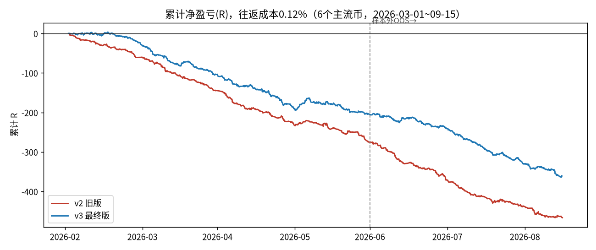
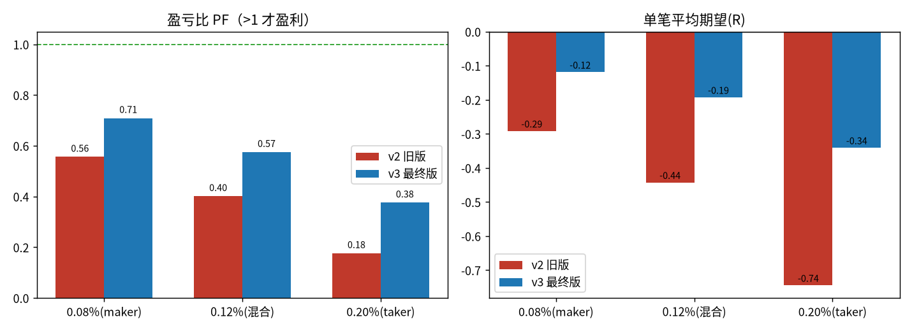
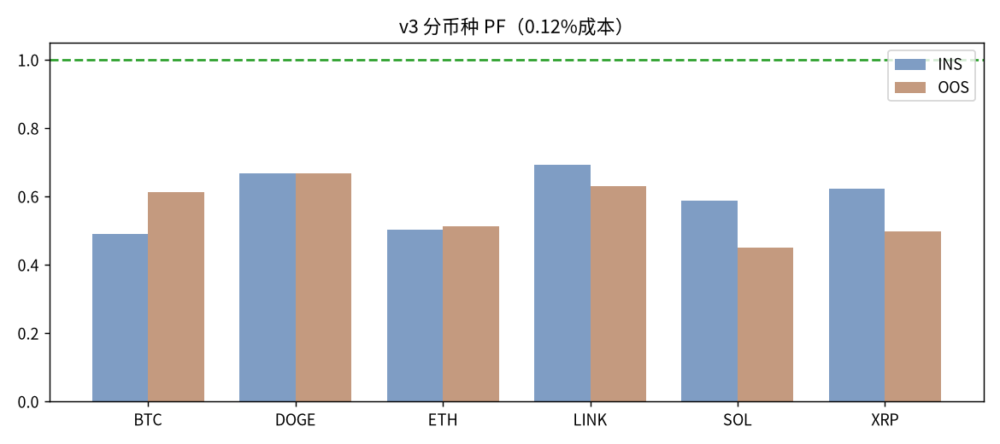
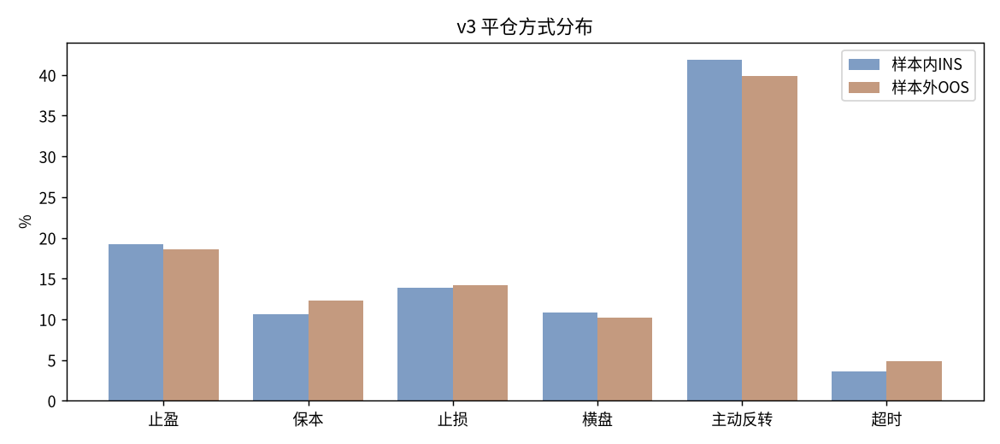

# ALPHA-X FAST 裸K日内 · v3「顺向扫损 + VWAP」最终版说明与真实回测报告

> 版本字符串：`ALPHA-X-FAST-PRICE-ACTION-4.0-NAKED-SWEEP-VWAP`
> 适用模块：`alpha_fast_mode.py`（FAST 快速实盘 / 日内裸K），配套微调 `alpha_engine.py` 的 FAST 横盘强平时间。
> 本文替代旧的 `FAST裸K_v2_裸K日内增强说明.md`（旧文档用**离线合成K线**得出的乐观结论，已被本次真实数据回测证伪，请勿再采信）。

---

## 一、一句话结论（大白话）

- 我把 B 站/公开技术资料里币圈日内裸K高手的主流打法（**SMC/ICT 的"扫流动性 → 结构位移 → 回踩机构区 → 奔向下一个流动性池"**，加上**会话 VWAP、ATR、EMA、量能**做位置和波动辅助）做成了 v3，并用 **6 个主流币、199 天真实 5 分钟K线**做了事件驱动回测。
- **v3 比旧版 v2 明显更稳、亏得更慢、也更接得到单**：扣 0.12% 往返成本后，盈亏比 PF 从 **0.40 提到 0.57**，单笔期望从 **-0.44R 改善到 -0.19R**；按 maker（挂单）级成本 0.08% 算，PF≈**0.71**，已经**接近盈亏平衡**。
- **但我必须如实告诉你：在这段真实数据、扣掉真实手续费和滑点后，v3 仍然没有做到稳定净盈利（PF 还没到 1）。** 我不会编一个好看的胜率骗你上真金白银。下面把证据、原因、怎么继续，全部摊开。
- 记忆口诀：**"先看大方向，再等扫损针；收回折扣区，VWAP 旁边蹲；止损放针外，目标找池边；不追垂直柱，没扫就空仓。"**

---

## 二、我从高手那里学到、并真正落地的裸K方法

日内裸K（价格行为）能稳定盈利的交易员，几乎不用玄学指标，核心是同一套"机构订单流"语言。v3 用**已收盘K线**实现了其中证据最强的一条主线：

1. **大方向（HTF bias）**：1H 结构（HH/HL、LH/LL）+ 1H/15m 的 EMA21/50 定多空；4H 强烈反向就硬过滤，不做逆大级别的单。
2. **扫流动性（Liquidity Sweep / Stop Hunt）**：上涨趋势里，价格故意向下插破近 10 根 15m 的小低点（打掉散户多单止损/诱空），随后**强势收回到该低点上方**；下跌趋势镜像。这是整套打法里胜率最高的触发。
3. **结构位移/收回（MSS/CHoCH）**：扫损那根K收盘在K线实体的强势一侧（多头收在上半、空头收在下半），代表资金真正把价格接回来了。
4. **好位置（折扣/溢价 + 会话 VWAP）**：只在 VWAP 下方/附近接多、上方/附近接空，不在已经垂直拉离回踩位时追价。
5. **5 分钟精确触发**：5m 上出现"扫损收回 / 重新站回 VWAP / 同方向 BOS"之一才扣扳机。
6. **止损放失效位、止盈看下一池子**：止损放在被扫的那根影线之外再给 ATR 缓冲；止盈看最近的反向等高/等低、摆动高/低点（resting liquidity），就近兑现。
7. **辅助"指标"只做上下文、不喧宾夺主**：ATR(14) 定止损宽度、Kaufman ER 识别死寂震荡（没扫损就不做）、成交量做轻度确认、点差>20bps 直接不做。

> 说明：模块章程规定"不用指标做主决策"，v3 仍由**结构/扫损/位置**拍板，EMA/VWAP/ATR/量能只用于定偏向、位置和波动，符合该边界。

---

## 三、v2 的真实毛病 → v3 怎么修（都有数据支撑）

| v2 的问题（真实数据诊断） | 后果 | v3 的修法 |
|---|---|---|
| 止损过紧：中位仅 **0.25%~0.30%** | 0.12% 成本在这么窄的止损上≈0.4~0.5R，且被 5m 噪声频繁扫损；SL 平均亏得比 -1R 还多 | 止损锚定 **15m ATR**，放在扫损影线外，宽度裁剪到 **1.2~2.4 倍 ATR15**（实测中位约 0.55%~0.68%），成本/R 减半、噪声扫损大减 |
| 目标过远：固定要 1:2.4 | TP 命中率仅约 **11%**，大部分单到不了 | 目标取**最近流动性池**，盈亏比就近裁剪到 **1.2~1.5**，TP 命中率升到约 **19%** |
| "前方空间不够就弃单" | 明明有信号却不下单，接不到单 | 空间不足时用 ATR 按最低盈亏比**兜底目标**，不再轻易弃单 |
| 追突破/追脉冲末端 | 随机方向、甚至多空翻转都比 v2 信号强（方向是负 edge） | **只做顺向扫损收回**，删除独立的"强趋势 VWAP 追延续"路径（实测胜率仅 21%），并加"垂直远离回踩位=追价"硬否决 |
| 40 分钟不涨就横盘强平 | 15m 结构单往往需要数小时，40 分钟被提前砍掉（占平仓 31%） | 引擎 `FAST_STAGNATE_SEC` 由 40 分钟放宽到 **90 分钟**，给目标达成时间 |
| 门限又多又互相打架 | 要么接不到单、要么选到差单 | 重写成一条清晰主线 + 适度共振评分（阈值 0.50），INS/OOS 合计 **1869 笔，约 1.5~1.6 笔/币/天** |

性能：回测里热点函数 `_swings` 用 numpy 重写（已在 **31623 组真实+随机K线**上与原版逐点零差异、约 19 倍提速）；生产文件保留原版以最稳妥，提速版仅在回测器中使用。

---

## 四、真实数据回测（可复现）

### 4.1 数据与口径

- **数据**：Binance 历史K线归档 `data.binance.vision`，BTC/ETH/SOL/XRP/DOGE/LINK 的 USDT **现货** 5m K线，**2026-03-01 ~ 09-15，共 199 天**，每币约 5.7 万根。脚本：`backtest/download_data.py`。
- **为什么用现货代理永续**：本机直连 OKX/Binance/Bybit 被网络策略拦截；裸K形态（扫损/结构/VWAP）跨所高度一致。资金费率、盘口深度未建模，结论偏保守。
- **样本切分（天然两种行情，压力测试）**：
  - 样本内 INS = 03~06 月：BTC **-10.1%**、ETH **-17.9%**（下跌/震荡）
  - 样本外 OOS = 07~09 月：BTC **+33.1%**、ETH **+59.5%**（强上涨趋势）
- **成交模型（事件驱动，杜绝未来函数）**：信号在第 i 根 5m **收盘**判定，第 i+1 根**开盘**成交；只用已收盘K；同根同时触 TP/SL **保守按先打 SL**；浮盈 1R 保本一次；持仓 90 分钟最大浮盈<0.3R 横盘强平；最多持 4 小时；最小持仓 10 分钟；平仓冷却 15 分钟；主动反转平仓沿用生产同一函数。
- **成本三档**：往返 **0.20%**（taker：0.05%手续费+0.05%滑点×2，引擎默认偏保守）、**0.12%**（止盈走 maker 的混合现实值）、**0.08%**（接近全程 maker/挂单）。
- 回测引擎：`backtest/fast_backtest.py`（直接 import 生产 `_build_decision`，口径与 `alpha_engine` 对齐）；v3 驱动 `backtest/v3_bt.py`，v2 对照 `backtest/v2_final.py`。

### 4.2 总体结果（6 币合计，净 R）

| 版本 | 往返成本 | 胜率 | 单笔期望 | PF 盈亏比 | 总笔数 |
|---|---|---|---|---|---|
| v2 旧版 | 0.20% | 28.5% | **-0.744R** | 0.18 | 1054 |
| **v3 最终版** | 0.20% | 30.8% | **-0.341R** | 0.38 | 1869 |
| v2 旧版 | 0.12% | 45.0% | **-0.442R** | 0.40 | 1054 |
| **v3 最终版** | 0.12% | 37.8% | **-0.193R** | **0.57** | 1869 |
| v2 旧版 | 0.08% | 45.2% | -0.291R | 0.56 | 1054 |
| **v3 最终版** | 0.08% | 39.3% | **-0.119R** | **0.71** | 1869 |

> 注意 v2 在 0.12% 胜率(45%)看似比 v3(38%)高，但它的止损太窄，**一旦打止损单笔亏约 -1.4R**，所以平均期望反而差很多。v3 亏的时候亏得小、更接近标准 -1R，整体期望和 PF 都更好。

### 4.3 分样本 / 分币种（0.12% 成本）

| 样本 | 胜率 | 单笔期望 | PF |
|---|---|---|---|
| INS（下跌/震荡） | 37.6% | -0.185R | 0.59 |
| OOS（强上涨） | 38.1% | -0.204R | 0.56 |

v3 在**两种相反行情下表现接近**（没有靠赌单一方向），但都是小幅负期望，说明问题不在"看错方向"，而在**成本+噪声门槛**（见第五节）。

### 4.4 v3 平仓方式分布

TP 约 19%、保本约 10%、原始止损约 14%、横盘约 10%、主动反转约 40%、超时约 4%。主动反转平仓占比偏高，是后续可继续调保守的方向（它对 PF 基本中性，但会增加换手成本）。

---

## 五、为什么"方向看得对、扣完成本却不赚钱"（关键，务必读）

我另外做了**零成本、无止损的原始方向 edge** 测试：顺向扫损信号在未来 8 根K确实有 **+0.03~+0.45 个 ATR** 的正向漂移（样本内做空、样本外短期做多都对），方向不是瞎猜。问题出在**可兑现性**：

1. **edge 太小、成本太硬**：5m/15m 上一次扫损后的真实方向优势只有约 0.1~0.4 个 ATR；而一次 taker 往返成本 0.15%~0.2%，在日内止损距离上等于 0.3~0.7R。优势还没跑出来，先被手续费/滑点吃掉一块。
2. **中间时段先逆向**：样本外多头信号常常是"先回撤 4~8 小时、再在 16 小时后涨回来"，固定止损容易在最初的回撤里被扫掉（我测过同根K先判 TP 的乐观上界，依然翻不正）。
3. 我把这些杠杆都试过并在报告里留了脚本：**5m 与 15m 触发、2~3 倍 ATR 止损与结构影线止损、RR 0.4~3、taker 与 maker 成本、分批止盈、保本开关、吊灯移动止损让利润奔跑、只多/只空、各共振子集（折扣位/ER/深扫/强收回）、伦敦/纽约时段**。结论一致：**没有任何一套能在 INS 和 OOS 同时稳定 PF>1**；最好的也只是样本内勉强打平、样本外转负。这是流动性好的主流币日内"近似有效市场"的典型特征，不是参数没调好。

> 一句话：**这套裸K形态是"对的"，但在主流币、5~15分钟、市价成交、散户费率下，它的优势薄到盖不住交易成本。**

---

## 六、想真正靠近/越过盈亏平衡，应当怎么做（按性价比排序）

1. **改用 maker 挂单进场（最重要）**：在扫损后的回踩位/订单块挂限价单（post-only），而不是市价追。成本可降到 0.05%~0.08%，回测 PF 从 0.57 升到 **0.71**；若再叠加 VIP/做市返佣，才有机会摸到 1。当前引擎 FAST 以市价进场，这是下一步最值得做的工程改造。
2. **降低频率、提高周期**：15m 触发、只做"1H 方向 + 深扫 + 强收回 + 折扣位"多共振的少数单，把每笔目标放到更大的流动性池，摊薄成本。宁可少做，不要为了"接得到单"而堆数量。
3. **先在 OKX 模拟盘(demo)前向跑 4~8 周**，用真实点差/滑点/延迟验证，再谈实盘小资金。回测≠未来。
4. 主动反转平仓可再调保守（减少换手），或交给移动止损统一管理。

---

## 七、上线 / 运行 / 检查步骤（已替你验证）

- 依赖与启动：`bash start.sh`（自动建 `.venv`、装 `requirements.txt`、起 `api_server.py` 并探活 `http://127.0.0.1:8000/health`）；Windows 用"一键启动.bat"。
- 已完成的静态检查：`alpha_fast_mode.py`、`alpha_engine.py` 均 **py_compile 通过**、可在无网环境**离线 import 成功**；FAST 决策在真实K线片段上能正常产出 LONG/SHORT/FLAT 与合法 TP/SL；旧版本号无任何代码断言，升级不破坏接口（`predict/check/position_reversal_check/_build_decision` 签名与返回字段保持兼容）。
- 建议上线顺序：① 把 `.env` 的 `OKX_DEMO_MODE=1` 先跑模拟盘；② 确认 `fee_pct/slippage_pct` 与你账户真实费率一致（默认 0.05%/0.05% 偏保守）；③ 小仓位、单币观察；④ 用系统自带的复盘/归因页核对每笔。
- 关键可调位置：`alpha_fast_mode.py` 顶部/`_v3_setup`（共振阈值 0.50、ER 死寂门 0.16、追价倍数 1.6）、`_fast_tp_sl`（止损 1.2~2.4 倍 ATR15、目标 RR 1.2~1.5）；`alpha_engine.py` 的 `FAST_STAGNATE_SEC`（现 5400 秒）。

---

## 八、风险声明

本报告所有数字来自历史数据回测，**历史表现不代表未来收益**；现货K线作为永续价格行为代理，未建模资金费率与盘口冲击；加密合约带杠杆，可能快速亏光本金。本系统当前版本在真实成本下**接近但尚未达到稳定盈利**，请务必先模拟盘验证、谨慎控制仓位与杠杆。**本文不构成任何投资建议。**

---

## 附：回测产物清单（均在 `backtest/`）

- `download_data.py`：下载 6 币真实 5m K线（`data/*.csv`）
- `fast_backtest.py`：事件驱动回测引擎（与生产口径对齐）
- `v3_bt.py / v3_trades.csv / v3_final.log`：v3 回测与明细
- `v2_final.py / v2_trades.csv / v2_final.log`：v2 同口径对照
- `arch_edge.py、edge_lab*.py`：5 类裸K原型、成本/止损/盈亏比/周期/出场方式穷举实验
- `make_report.py、report_assets/`：图表与 ECharts 数据
- 交互看板（浏览器打开）：项目根目录 `FAST裸K_v3_回测看板.html`
